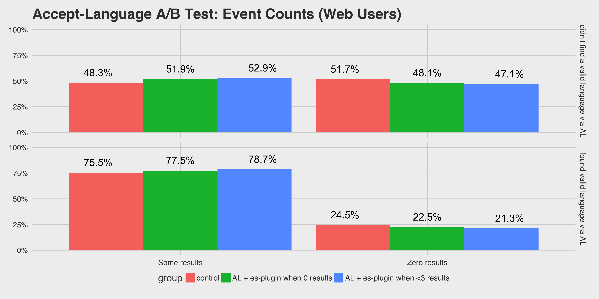

```{r setup, include = FALSE}
options(digits = 4, scipen = 500)
knitr::opts_chunk$set(echo = FALSE, warning = FALSE, message = FALSE, eval = FALSE)
load("AcceptLangTestRefined.RData")
```

```{r pkgs}
library(BCDA)
library(purrr) # install.packages("purrr")
```

```{r utils}
source("utils.R")
import::from(polloi, compress)
prop_table <- function(x, margin = 1, include_raw = FALSE, digits = 1) {
  y <- prop.table(x, margin = margin)
  z <- y
  for ( i in 1:nrow(x) ) {
    for ( j in 1:ncol(x) ) {
      if (include_raw) {
        z[i, j] <- sprintf(paste0("%s (%.", digits,"f%%)"), compress(x[i, j], digits), 100 * y[i, j])
      } else {
        z[i, j] <- sprintf(paste0("%.", digits,"f%%"), 100 * y[i, j])
      }
    }
  }
  return(z)
}
bcda_battery <- function(x, a = 1, b = 1, c = 1, d = 1, conf_level = 0.95, flip_results = FALSE) {
  temp <- print(test_indepen(x))
  temp <- matrix(c(
    ci_prop_diff_tail(x, a, b, c, d, conf_level),
    ci_relative_risk(x, a, b, c, d, conf_level),
    ci_odds_ratio(x, a, b, c, d, conf_level)),
    ncol = 2, byrow = TRUE)
  colnames(temp) <- c("Lower Bound", "Upper Bound")
  rownames(temp) <- c("Difference of Proportions", "Relative Risk", "Odds Ratio")
  if (flip_results) {
    temp["Difference of Proportions", ] <- -rev(temp["Difference of Proportions", ])
    temp["Relative Risk", ] <- rev(1/temp["Relative Risk", ])
    temp["Odds Ratio", ] <- rev(1/temp["Odds Ratio", ])
  }
  return(temp)
}
```

## Summary

This was an A/B test to determine the impact of switching search languages in the case that a query produces zero results or fewer than 3 results. While we previously used the elasticsearch plug-in "langdetect" to detect the query's language, we postulated that we should first try finding a valid language using the Accept-Language header, if it is detected.

We found evidence that the Accept-Language header detection makes a slight positive difference to the zero results rate, with 3.18-3.34% more requests getting some results in the test group than the control group, and the test group being 1.026-1.029 more likely to get some results than the control group when we found a valid language via Accept-Language detection.

As with the previous test, we recommend collecting data about users' interaction with the results to see whether the language detection (via AL and/or es-plugin) produces useful results, not just some results.

## Introduction

Using the first non-English Accept-Language HTTP header will provide a good proxy for the language the query is in when the query returns no results against the wiki it was already run against. We postulated that this is a better proxy than the existing elasticsearch "langdetect" plugin we tested previously (Keyes et al., 2015).

There were three total groups of requests: the control group with status quo settings, the requests for which we performed a language detection based on Accept-Language (AL) header and then elasticsearch plug-in (es-plugin) when there were 0 results returned, and the requests for which we performed a language detection when there were less than 3 results returned. If the AL detection could not find a valid language, we fell back on the es-plugin detection.

## Methods

1 out fo 7 requests were sampled. Since the sampling process is pseudo-random yet deterministic, if a user was selected for this test on their first request, they would be selected for the test on subsequent requests. Thus, each group had a sampling rate of 1 in 21 sample requests.

First, we counted the number of events per user (uniquely identified by their IP, User Agent, and X-Forwarded-For). After looking at the counts of events, we restricted our **Web** dataset to users who made less than 7 search requests, which accounts for 99% of the data. The top 1% of **Web** users was excluded from analysis because they would skew the results.

While API requests are included in this test, the API user must pass an explicit flag opting into the general query rewriting feature which basically no-one enables. Any measurable effect will be entirely within users of the **Web**-based search.

To perform the analysis, we employed Agresti and Min's (2005) methods for computing Bayesian confidence intervals.

## Results



```{r table_web}
web %>%
  split(.$accept_language) %>%
  map(~ xtabs(events ~ group + results, data = .)) %>%
  map(~ prop_table(x = ., include_raw = TRUE))
```

We compared controls with the group where AL & es-plugin were used when 0 results were returned, and computed the following 95%-probability intervals:

```{r bcda_web}
web %>%
  split(.$accept_language) %>%
  map(~ xtabs(events ~ group + results, data = .)) %>%
  map(~ bcda_battery(x = .[c(2, 1), ]))
```

Among those for who we *were __not__ able to detect a valid language via AL*, 2.8%-4.4% more users received results in the test group and were 1.058-1.093 times more likely to receive results than the control group.

Among those for who we *__were__ able to detect a valid language via AL*, 2%-2.2% more users received results in the test group and were 1.026-1.029 times more likely to receive results than the control group.

#### Less than 3 results

We also peformed this test with a test group who had received less than 3 results.

```{r bcda_web_less3}
web %>%
  split(.$accept_language) %>%
  map(~ xtabs(events ~ group + results, data = .)) %>%
  map(~ bcda_battery(x = .[c(1, 3), ], flip_results = TRUE))
```

Among those for who we *were __not__ able to detect a valid language via AL*, 3.87%-5.46% more users received results in the test group and were 1.08-1.11 times more likely to receive results than the control group.

Among those for who we *__were__ able to detect a valid language via AL*, 3.18-3.34% more users received results in the test group and were 0.95-1.044 times more likely to receive results than the control group, which is to say we cannot conclude that their search results were impacted in a significantly positive way.

## References

- Keyes, O., Bernhardson, E., Causse, D., Garry, D., Popov, M. (2015). Results of Second Language Switching A/B Test. *Wikimedia Commons*. ([PDF](https://commons.wikimedia.org/wiki/File:Second_Language_Switching_Test.pdf))
- [User:EBernhardson (WMF)/Notes/Accept-Language](https://www.mediawiki.org/wiki/User:EBernhardson_(WMF)/Notes/Accept-Language)
- [Discovery/Testing: Language detection via Accept-Language](https://meta.wikimedia.org/wiki/Discovery/Testing#Language_detection_via_Accept-Language)
- Popov, M. (2015). Assessment of bucketing used for backend tests which report to CirrusSearchUserTesting log. *Wikimedia Commons*. ([PDF](https://commons.wikimedia.org/wiki/File:Wikimedia_Cirrus_Bucketing_Assessment.pdf))
- Agresti, A. and Min, Y. (2005). Frequentist performance of Bayesian confidence intervals for comparing proportions in 2x2 contingency tables, *Biometrics*, **61**, 515-523. doi:10.1111/j.1541-0420.2005.031228.x
